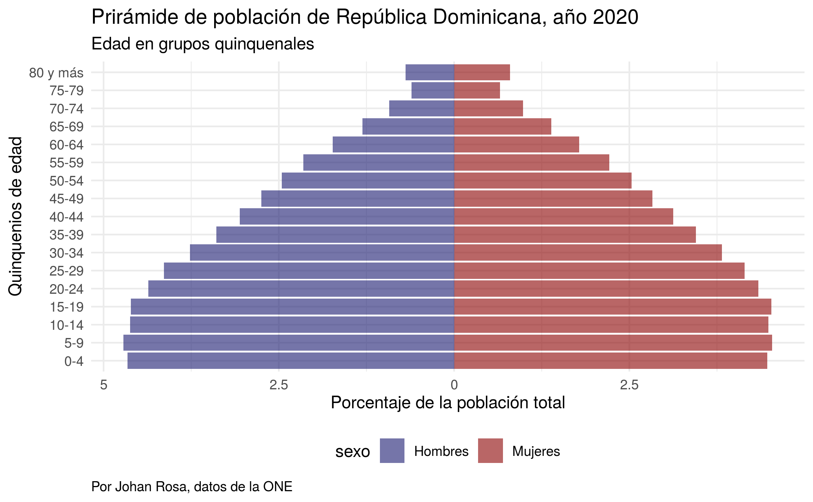

```{r setup, include=FALSE}
knitr::opts_chunk$set(echo = TRUE)
```

Este repositorio contiene una guía para la realización de pirámides de población en R. Todas los insumos y sus manipulaciones se incluyen, garantizando la completa reproducción del contenido.

## Visualizaciones realizadas




