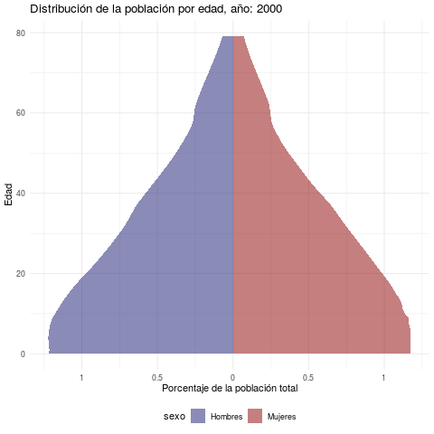

Las pirámides de población son de los gráficos más comunes en el análisis demográfico, por lo que muy probablemente alguien que realiza trabajos o investigaciones en las ciencia sociales necesitaría crear alguno de cuando en vez. Como no existe una geometría en `ggplot2` para hacer este tipo de visualizaciones, podría ser un tanto difícil hacerlas. 

En esta publicación haremos pirámides de población usando ggplot2. Mostraremos la distribución porcentual de la población por grupos quinquenales de edad y luego por edad específica. Finalemente terminaremos con una animación en la que se presenta la evolución de la composición demográfica del país según las estimaciones y proyecciones oficiales de población. El código y la data para reproducir todo el contenido lo pueden encontrar en el repositorio en github de la publiación. 

## Paquetes

```{r}
library(tidyverse)
library(gganimate)
```

## La data

El set de datos lo publicó la Oficina Nacional de Estadísticas, auque, por la forma en la que comparten la información, hubo antes que reestructurar los resultados (El excel con los archivos originales está en la ruta "data/proyeccion_poblacion_edad.xlsx" del repositorio, por otro lado, la manipulación realizada está en el script "scripts/data_wrangling.R"). La reestructuración consistió en combinar los datos para hombres y mujeres, y separar en columnans distintas la edad simple y en grupos quinquenales. 

```{r}
poblacion <- readRDS("data/poblacion.RDS")
head(poblacion)
```

## A crear pirámides de población

El primer paso para crear las pirámides es hacer negativos los valores de uno de los dos sexos, así es posible que los resultados de cada uno se deplieguen en direcciones opuestas en el gráfico. En este ejemplo la cantidad o porcentaje de hombres según edad estará en negativo.

```{r}
poblacion_piramide <- poblacion %>%
  mutate(
    porcentaje_total = ifelse(sexo == "Hombres", -porcentaje_total, porcentaje_total),
    poblacion = ifelse(sexo == "Hombres", -poblacion, poblacion)
    )
```

### Pirámide para un año con `geom_col()`

La geometría `geom_col()` es quizás la más común para la creación de este tipo de gráficos. En este primer caso la estrategia es mapear `edad_quinquenal` al eje X y `porcentaje_total` al eje Y.

Es importante resaltar que la función `geom_col()` tiene dististas posiciones, en caso de que se quieran crears barra de diferentes subgrupos de datos. 

La estructura de la data podría conducir a la realización de pasos innecesarios, porque como la desagregación de los datos es a nivel de edades simples y cualquiera podría pensar que debe sumar la población de las edades simples en cada grupo quinquenal, pero en realidad para tener barras con las edades en grupos quinquenales solo hay que apilar las barras de las edades simples. La función la función `geom_col()` tiene dististas posiciones, el argumento `position = "stack` ayuda en este sentido. De igual forma, se coloca comentado el paso que intuitivamente se hubiese tenido que dar. 

```{r piramide_2020, message=FALSE, warning=FALSE}
subset(poblacion_piramide, year == 2020) %>%
  # group_by(edad_quinquenal, sexo) %>%
  # summarise(
  #   poblacion = sum(poblacion),
  #   porcentaje_total = sum(porcentaje_total)
  #   ) %>%
  ggplot(aes(x = edad_quinquenal, y = porcentaje_total, fill = sexo)) + 
    geom_col(position = "stack", alpha = 0.6) + 
    coord_flip() +
    scale_fill_manual(values = c("midnightblue", "darkred")) +
    theme_minimal() +
    theme(legend.position = "bottom") +
    scale_y_continuous(labels = abs) +
    labs(
      y = "Porcentaje de la población total",
      x = "Quinquenios de edad",
      title = "Prirámide de población de República Dominicana, año 2020", 
      subtitle = "Edad en grupos quinquenales",
      caption = "")

ggsave("visualizaciones/piramide_2020.png")
```

Ahora una secuencia de gráficos para visualizar cómo ha cambiado la estructura de la población en cada década y qué se espera para el año 2030. Aquí lo más evidente es la reducción de la base de la pirámide, con cada vez menos personas en edades inferiores a 15 años, también hay más ancianos. 

```{r priramide_00_10_20_30, fig.height=10, fig.width=7, message=FALSE, warning=FALSE}
poblacion_piramide %>%
  filter(str_detect(year, "[0]$")) %>%
  ggplot(aes(x = edad_quinquenal, y = porcentaje_total, fill = sexo)) + 
  geom_col(alpha = 0.6) + 
  scale_fill_manual(values = c("midnightblue", "darkred")) +
  facet_wrap(~paste("Año", year), ncol = 1) +
  coord_flip() +
  theme_minimal() +
  theme(legend.position = "bottom",
        strip.text = element_text(size = 10, face = "bold")
        ) +
  scale_y_continuous(labels = abs) +
  labs(
    y = "Porcentaje de la población total",
    x = "Quinquenios de edad",
    title = "Transición demográfica en República Domincana",
    subtitle = "Estimaciones y proyeecions de poblacción")

ggsave("visualizaciones/priramides_00_10_20_30.png")
```

## Pirámides de población con geom_area

Para pirámides de población con las edades simples la recomendación una geometría más suave, que de la apariencia de ser continua. `geom_area` cumple esta función. En este ejemplo se ecluyen las edades superiores a 79 años, por no estar desagregadas en grupos quinquenales y distorcionar un poco la cuspide de la pirámide.

```{r poblacion_edad_simple_2020}
 poblacion_piramide %>%
  filter(year == 2020, edad < 80) %>% 
  ggplot(aes(
    x = edad, y = porcentaje_total,
    fill = sexo)
    ) + 
  geom_area(alpha = 0.6) +
  coord_flip() +
  theme_minimal() +
  scale_y_continuous(labels = abs) +
  scale_fill_manual(values = c("midnightblue", "darkred")) +
  theme(legend.position = "bottom") +
  #transition_time(year) +
  labs(
    title = 'Distribución de la población por edad, año 2020',
    x = "Edad",
    y ='Porcentaje de la población total')

ggsave("visualizaciones/poblacion_edad_simple_2020.png")
```

### Ahora una animación 

```{r}
p <- poblacion_piramide %>%
 filter(edad < 80) %>%
  ggplot(aes(
    x = edad, ymin = base,
    ymax = porcentaje_total,
    fill = sexo)
    ) + 
  geom_ribbon(alpha = 0.5) +
  coord_flip() +
  theme_minimal() +
  scale_y_continuous(labels = abs) +
  scale_fill_manual(values = c("midnightblue", "darkred")) +
  theme(legend.position = "bottom") +
  transition_time(year) +
  labs(
    title = 'Distribución de la población por edad, año: {as.integer(frame_time)}',
    x = "Edad",
    y ='Porcentaje de la población total')

animate(p, nframes = 40, renderer = gifski_renderer("visualizaciones/piramide_animation.gif"))

```



